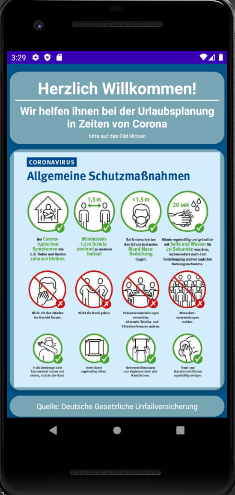
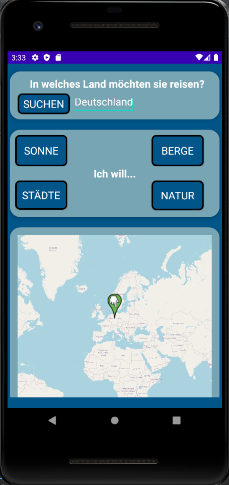
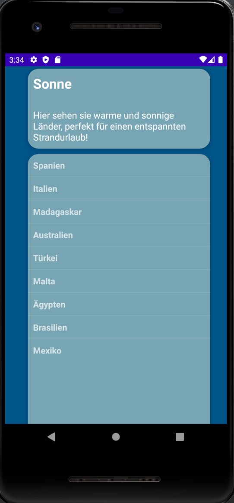
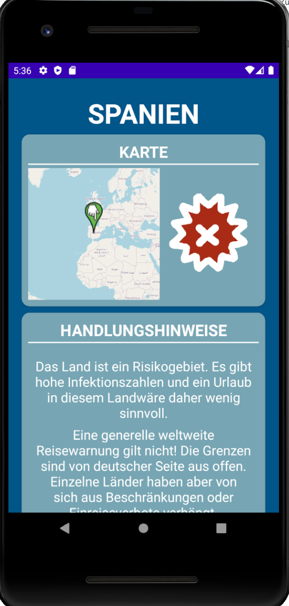

# guidance

How does the app work and what can it do? 
The individual UIs and their functions are explained in more detail below.

>
## MainActivity
- When the app starts you see this screen. The user is welcomed and the purpose of the app is briefly explained. 
- A note indicates that the image with the protective measures must be clicked.
- These protective measures have been adopted by the German Social Accident Insurance, as described below in the source. 
- The interface is built with a ScrollView and CardViews. Therefore, the individual cards can be used. When clicking the middle card, 
you will be redirected to the next view. 

**This interface serves as a start page.**
         

>
## MapFragment
- This interface allows the user to further narrow down their vacation destination. 

You can either **search for a single country** and display it on the map, or **select one of the buttons** on the 2nd cardview. 

- If you search for a single country with the search button, a marker is set on the mapview below. This marker can be deleted if you keep it pressed for a longer time. If the user presses the marker, he will be forwarded directly to the country details for this country.

- The buttons on the 2nd cardview represent vacation categories. Via these buttons you will be forwarded to a country selection. 

**This interface serves as input of the country to be specified.**
       

>
## DestinationsList
- This interface presents a selection of countries for the category chosen by the user. 

- The category is displayed with a short explanatory text and the list of 10 countries. The countries have been selected from various sources of tourism.

**This interface is used to select a country limited by the selection of a vacation category.**
           
**red Coroni:** risk area
**green coroni:** no risk area
**orange Coroni:** was risk area in the last 10 days, but is not anymore.

 
>
## CountryDetails
this interface displays the country details for the selected country. 

There are 5 cardviews:
- 1. CardView:** Here is a map with marker on the country and the matching Coroni assigned. The coronis are selected according to the data from the RKI website. 

- **2. CardView:** This view displays action instructions.

- **3. CardView:** This view provides a redirect to the State Department page. There you can get more information about entry requirements.

- **4. CardView:**

- **5. CardView:** This CardView shows the source of our data for the current numbers. If you click on it, you will be redirected to the API.

**This interface is used to display country details associated with corona.**
