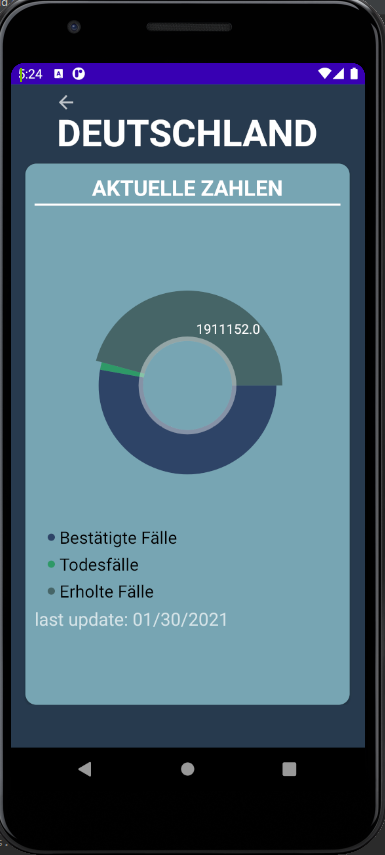

# User Guide

How does the app work and what can it do? 
The individual UIs and their functions are explained in more detail below.

>
## MainActivity
- When the app starts you see this screen. The user is welcomed and the purpose of the app is briefly explained. 
- A note indicates that the image with the protective measures must be clicked.
- These protective measures have been adopted by the German Social Accident Insurance, as described below in the source. 
- The user interface is built with a ScrollView and CardViews. Therefore, the individual cards can be used. When clicking the middle card, 
you will be redirected to the next view. 

**This UI serves as a start page.**

         

>
## MapFragment
- This user interface allows the user to further narrow down their vacation destination. 

- You can either **search for a single country** and display it on the map, or **select one of the buttons** on the 2nd cardview. 
    - Please keep in mind, that the app will only display countries, not cities!
    - The input can either be in german or english
    - The input can only be a country!

- If you search for a single country with the search button, a marker is set on the mapview below. This marker can be deleted if you keep it pressed for a longer time. If the user presses the marker, he will be forwarded directly to the country details for this country.

- The buttons on the 2nd cardview represent vacation categories. Via these buttons you will be forwarded to a country selection. 

**This UI serves as input of the country to be specified.**

       

>
## DestinationsList
- This user interface presents a selection of countries for the category chosen by the user. 

- The category is displayed with a short explanatory text and the list of 10 countries. The countries have been selected from various sources of tourism.

**This UI is used to select a country limited by the selection of a vacation category.**

            

## Coronis - Risk areas
  
- **Red Coroni:** currently a risk area.
- **Orange Coroni:** is not currently a risk area but was one in the last 10 days.
- **Green Coroni:** is not currently a risk area.

 

>
## CountryDetails
This user interface displays the country details for the selected country. 
There are 5 cardviews:
- **1. CardView:** Here is a map with marker on the country and the matching Coroni assigned. The coronis are selected according to the data from the RKI website. 

- **2. CardView:** This view displays action instructions.

- **3. CardView:** This view provides a redirect to the State Department page. There you can get more information about entry requirements.

- **4. CardView:** When the user clicks on the card, he is redirected to another UI. On this page the current numbers in the country related to corona are shown in a piechart.

- **5. CardView:** This CardView shows the source of our data for the current numbers. If you click on it, you will be redirected to the API.

**This UI is used to display country details associated with corona.**
   

>
## PieChart
This user interface shows a PieChart with data for the selected country from:
- Confirmed cases
- Death cases
- Recovered cases.
With a button you can return to the country details.
The PieChart is clickable, so the values will be highlighted if the slice is tapped.
The PieChart is rotatable, so the slides can be dragged in the desired direction.

**This UI serves as input of the country to be specified.**
